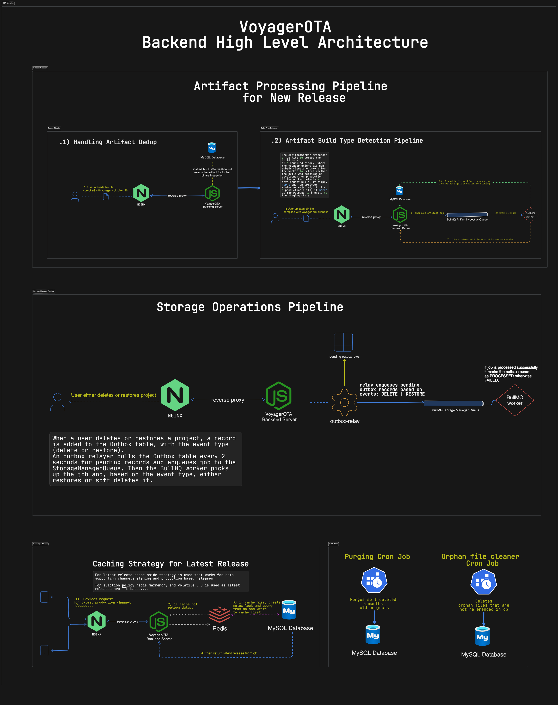

# VoyagerOTA
> A mini backend system for managing software releases for devices.
> Every release is treated as a proper artifact, versioned, validated, and deployed to the correct channel.
> Only verified production builds reach field devices.

## Features
- [x] Create draft releases with versioning and changelogs.  
- [x] Prevent version collisions and duplicate binaries.  
- [x] Background workers validate build types automatically.  
- [x] Verified production builds move to a safe staging channel.  
- [x] Promote releases to production with explicit approval.  
- [x] Rollback or revoke releases when necessary.  
- [x] Devices fetch updates efficiently via cache or database.
## Planned Features
- [ ] Devices report if updates are applied.  
- [ ] Basic health and telemetry via MQTT.


## Release Flow
1. **Draft Release**: Create a release draft with only metadata (version, changelog), no binaries yet.
2. **Upload Binary**: Submit the compiled binary; the system hashes it and rejects duplicates.
3. **Build Inspection**: Background workers analyze the binary to determine its build type.
4. **Staging Channel**: Verified production builds are moved to the staging channel for testing.
5. **Promotion to Production**: Manually approve and promote the release to production.
6. **Device Fetching**: Devices fetch updates from the appropriate channel (staging or production) depending on their mode.

## Architecture
<p align="center">
  
</p>

## Release Rules
- Versions must always advance; duplicates rejected
- Only one non-production release per project
- Development/unknown builds cannot be promoted
- Promotion requires explicit action
  
## Setup
> [!NOTE] 
> Create a `.env.development` file in the root before running the server.
```env
npm install

# then run server in development mode....
npm run dev

# and then run artifact worker separately.....
npm run artifact-worker
```

## Integration
> [!TIP]
> Use the official client library  [**voyagerota-client-lib**](https://github.com/mediocre9/voyagerota-client-lib) to handle OTA updates on ESP32 and ESP8266 devices.
> <br>
> For full integration details, see the official documentation: [VoyagerOTA Documentation](https://staging.api.voyagerota.com/docs)
