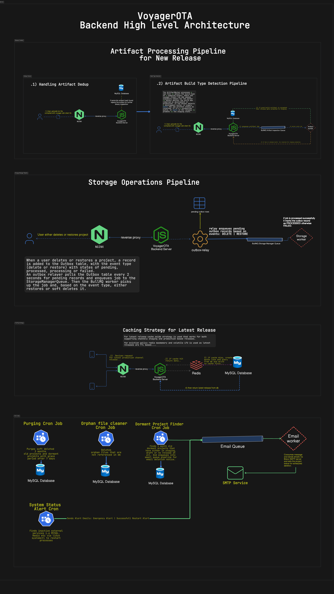

# VoyagerOTA

Backend platform for managing over-the-air (OTA) firmware releases for embedded devices.

[](LICENSE)
[](#)
[](https://github.com/mediocre9/VoyagerOTAClient)

## What is VoyagerOTA?

> VoyagerOTA is a backend platform for managing firmware updates over-the-air (OTA). It is designed for embedded projects, especially ESP32, providing a structured release workflow with monotonic semantic versioning and asynchronous processing.

## Features

- [X] Monotonically increasing semantic versioning.
- [X] Background processing using dedicated workers.
- [X] Artifact build hash collision prevention.
- [X] Transactional storage operations using the Outbox Pattern.
- [X] Redis based release caching.
- [X] Staging and production release channels.
- [X] Production release revocation.
- [X] Project deletion and restoration.
- [X] Automatic orphan file storage cleanup.
- [X] Automatic expired records purging.
- [X] Dormant project detection with email notifications.

## Planned Features

- [ ] Device update reporting

## Quickstart

> [!NOTE]
> Create a `.env.development` file in the project root before running the server.

```bash
npm install

# then run server in development mode....
npm run dev

# run each of the following separately.....
npm run artifact-worker
npm run storage-worker
npm run email-worker

npm run outbox-relay

npm run orphan-cron
npm run purger-cron
npm run dormant-project-cron
```
## Client Sdk Integration

> [!TIP]
> Download the latest [official client](https://github.com/mediocre9/VoyagerOTAClient/releases/latest) sdk library to handle OTA updates on ESP32 devices.
> For complete integration instruction details please visit here: [VoyagerOTAClient](https://github.com/mediocre9/VoyagerOTAClient#getting-started).

```cpp
#define __USE_STAGING_CHANNEL__ true
#define CURRENT_FIRMWARE_VERSION "1.0.0"

#include <VoyagerOTAClient.h>
#include <WiFi.h>
using namespace Voyager;

void connectToWifi() {
    WiFi.begin("SSID", "PASSWORD");
    while (WiFi.status() != WL_CONNECTED) {
        Serial.print(".");
        delay(50);
    }
    Serial.println("Connected to Internet");
}

void setup() {
    Serial.begin(9600);
    connectToWifi();
    OTA<HTTPResponseData, VoyagerReleaseModel> ota(CURRENT_FIRMWARE_VERSION);

    ota.setCredentials("voyager-project-id-here....", "voyager-api-key-here...");
    ota.setBaseURL("voyager-base-url.....");

    auto release = ota.fetchLatestRelease();

    if (release && ota.isNewVersion(release->version)) {
        Serial.println("New version available: " + release->version);
        Serial.println("Changelog: " + release->changeLog);
        ota.setDownloadURL(release->downloadURL);
        ota.performUpdate();
    } else {
        Serial.println("No updates available");
    }
}

void loop() {}
```

### System High Level Architecture Diagram

<p align="center">
  
</p>

## License

This project is licensed under the MIT License. See the [LICENSE](https://github.com/mediocre9/voyager-ota/blob/main/LICENSE) for details.
